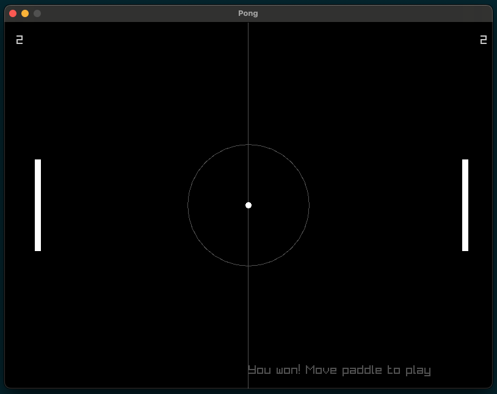

# PONG

This is a PONG game created with Raylib.

1. To make the library visible in IDE, run `./init_clangd.sh`.
2. To compile the program, run `cmake .`, then `cmake --build .` and then `./pong`.
3. The result should look like so: 

